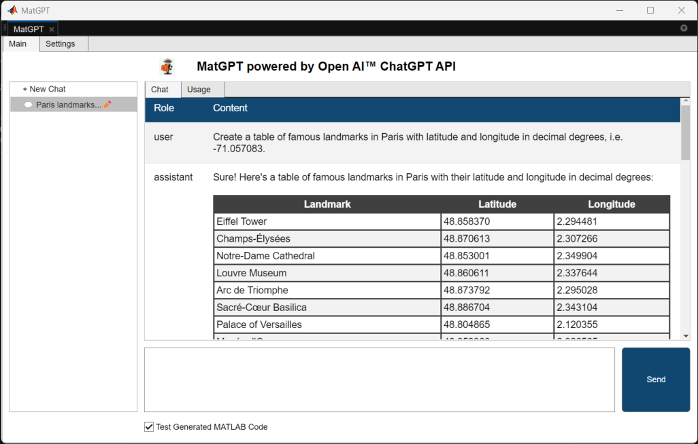

# MatGPT - MATLAB&reg; app and class to access ChatGPT API from OpenAI&trade;
[](https://matlab.mathworks.com/open/github/v1?repo=toshiakit/chatgbt_matlab)


MatGPT is a MATLAB app powered by chatGPT class that allows you to easily access the ChatGPT API provided by OpenAI. With the app, you can load a list of prompts for specific use cases and engage in conversations with ease. If you're new to ChatGPT and prompt engineering, MatGPT is a great way to learn. If you're already familiar with ChatGPT, you can directly use the class.

The app and the class are mere conduit to ChatGPT API, and you should be familiar with the limitations and risks associated with using this technology with [OpenAI terms and policies](https://openai.com/policies). You are also responsible for any fees OpenAI may charge for the use of their API. 

## Requirements

* **MathWorks Products (https://www.mathworks.com)**:  To use MatGPT, you need to have MATLAB R2020a or later installed on your computer. 
* **OpenAI API Key**: Additionally, you will need your own API key from [https://beta.openai.com/account/api-keys](https://beta.openai.com/account/api-keys).

# Installation

1. Download the content of this repository into a MATLAB path. 
2. Launch MATLAB
3. Before using, set an environment variable with your OpenAI API key named `OPENAI_API_KEY`. **You may want to add this to your startup file**. 

```matlab
setenv("OPENAI_API_KEY","your key here")
```
4. Open MatGPT.mlapp in App Designer and click 'Run'

## How to use - MatGPT app


1. Click on "+ New Chat" in the left nav to add a new chat. This opens the Settings tab. 
2. In the Settings tab, either choose a preset to populate the settings or customize on your own. Once you have completed the settings, click "Start New Chat" to initiate a chat. This will take you back to the Main tab. 
3. In the Main tab, a sample prompt is already provided based on the preset you selected, but feel free to replace it with your own. When you click `Send` button, the response will be shown in the 'Chat' tab. 
* The `Send` button is disabled until a chat is configured in the Settings tab.
* If your prompt is intended to generate MATLAB code, Check `Test Generated MATLAB Code` checkbox to test the returned code.
* The Usage tab shows number of tokens used and the cost incurred in the current chat session. 
4. Continue the conversation by keep adding more prompts and clicking `Send`. 
5. You can right-click a chat in the left nav to rename, delete, or save the chat to a text file. 
6. When you close the app, the chat will be saved and will be reloaded into the left nav when you relaunch the app.

## How to use - chatGPT class

chatGPT class creates an instance to access OpenAI API using your own API key, and optionally `max_tokens` that determine the length of the response. Once you create an instance, then you can use its chat method to post prompt via OpenAPI ChatGPT API released on March 1, 2023.

### Where to find it
chatGPT class is located in `helpers` folder. 

### Set up the bot
First, make sure you set your OpenAI API key in the environment variable as shown above. 
Create an instance using the default parameters. Your API key will be loaded from the OS environment variable. 

```matlab
myBot = chatGPT();
``` 

You can also set `max_tokens` parameter, which determines the length of the response. If you don't specify `max_tokens`, the response will be limited to up to 1000 tokens. The `max_tokens` must be less than 4096. 

```matlab
myBot = chatGPT(max_tokens=50);
```
You can also specify other parameters, such as `model` and `temperature`.
* models: gpt-3.5-turbo (default - stable release), gpt-3.5-turbo-0301 (latest release) 
* temperature: 0 = more strict, 1 =  balanced, 2 = more creative

You can pass a `role` to prime the chatbot for a specific use case. By default the chatbot is primed to act as an AI assistant, using the prompt "You are a helpful assistant." You can customize this for specific use cases. 

```matlab
role = "You define the role the chatbot should play.";
myBot = chatGPT(model="gpt-3.5-turbo", max_tokens=1000, temperature=0.9,role=role);
```

### Chat with the bot
Use the instance you created to send your prompt to the API. 

```matlab
answer = chat(myBot,"your prompt")
```
You will get an error if the API didn't return response successfully.

### Check the token usage
Use `usage` method to obtain the total number of tokens used in the current session. It returns both the number of tokens as well as the cost. 

```matlab
[tokens,cost] = usage(myBot)
```
### Save the chat history
Use `saveChat` method to save the chat history to a file. The supported format includes .mat, .xlsx, and .json. 

```matlab
[tokens,cost] = saveChat(myBot,format=".xlsx")
```
## Acknowledgement
This code is adapted from [this MATLAB Answers comment](https://www.mathworks.com/matlabcentral/answers/1894530-connecting-to-chatgpt-using-api#answer_1154780) by [Hans Scharler](https://www.mathworks.com/matlabcentral/profile/authors/5863695) and uses Brian Bruechel code checker and other great contribution. 
   
## License
The license for MatGPT is available in the LICENSE.TXT file in this GitHub repository.


